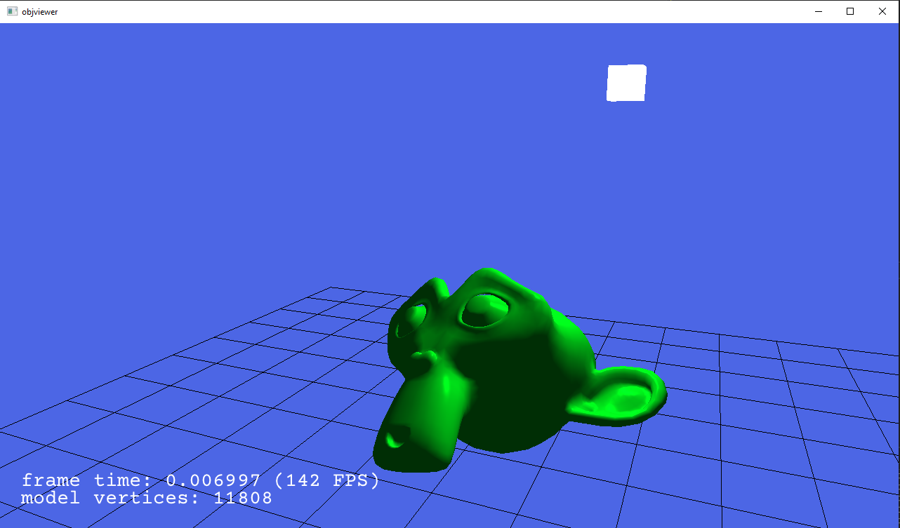

# OBJ viewer

A simple .obj model viewer written pretty much from scratch using C++ and D3D11.

## Features

- Vector & matrix math
- WIN32 window & input handling
- OBJ model loader
- Stats text rendering using STB_truetype
- Phong shading on loaded model
- Reference grid
- FPS flying camera + mouse drag to rotate model

